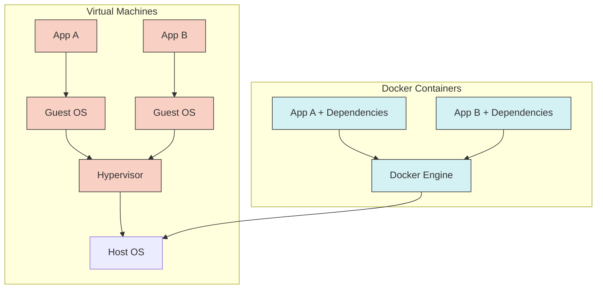
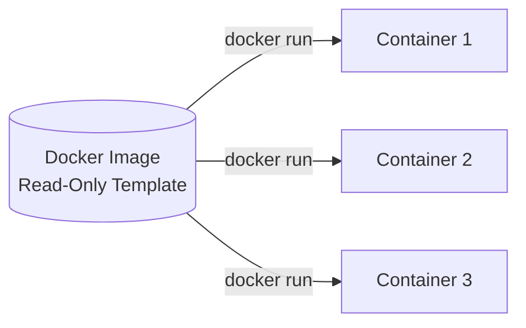
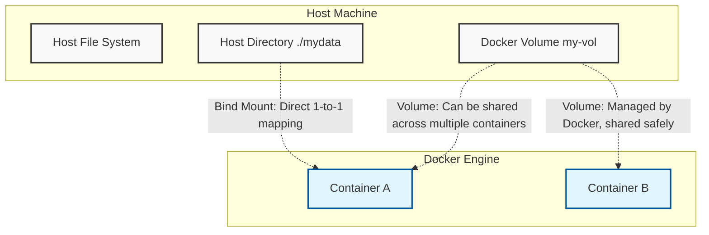
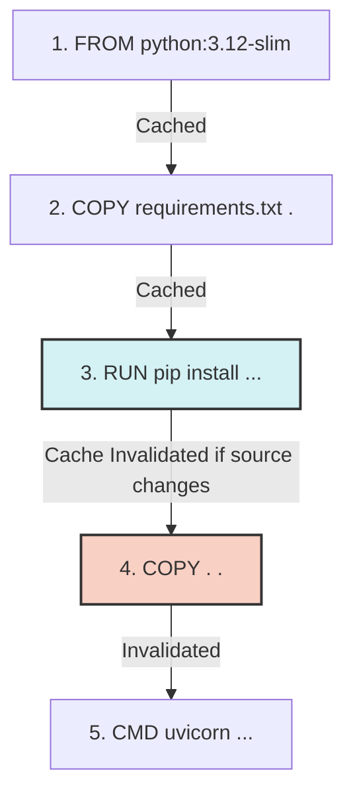
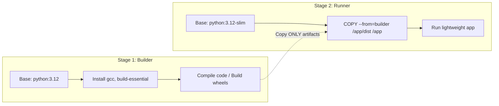
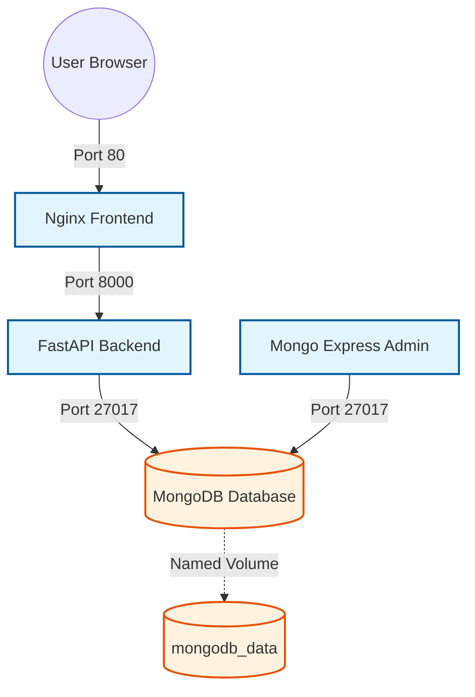

# Docker Tutorial for Beginners: A Comprehensive Guide

## 1. The "Why": Solving the Dependency Problem
At its core, Docker solves the classic "it works on my machine" problem. When software runs on your computer but fails on a server or a co-worker's machine, hidden system dependencies (OS packages, environment configurations, library versions) are usually to blame. 

Docker packages your application along with *all* its dependencies into an isolated, portable unit called a **container**.

### Architecture: Virtual Machines vs. Docker Containers
Containers are fundamentally different from Virtual Machines (VMs). 



| Feature | Virtual Machines (VMs) | Docker Containers |
| :--- | :--- | :--- |
| **Isolation Level** | Emulates entire guest OS & virtual hardware | Shares host OS kernel, isolates processes |
| **Size** | Heavy (Gigabytes) | Lightweight (Megabytes) |
| **Boot Time** | Slow (Minutes) | Near-instant (Under a second) |
| **Performance** | Overhead from hypervisor | Near-native performance |

---

## 2. Core Concepts & CLI Fundamentals

### Images vs. Containers
* **Image:** A read-only template or "recipe" specifying the file system, packages, environment variables, and startup commands.
* **Container:** A running, writable instance of an image. You can launch dozens of identical containers from a single image simultaneously.



### Essential CLI Commands
| Command | Flag / Argument | Description |
| :--- | :--- | :--- |
| `docker run` | `-d` | **Detached mode:** Runs the container in the background. |
| `docker run` | `-p 8080:80` | **Port mapping:** Connects host port `8080` to container port `80`. |
| `docker ps` | *(none)* | Lists currently running containers. |
| `docker container prune` | *(none)* | Removes all stopped containers to free up space. |
| `docker exec` | `-it <id> bash` | Opens an interactive shell inside a live container for debugging. |

### Image Tags, Digests & Base Distros
* **Tag Risk:** Tags like `nginx:1.27` are mutable pointers (they can be updated). For production stability, **pin images by SHA-256 digest** (`image@sha256:...`).
* **Base Distro Sizing:** Choosing the right base image drastically reduces attack surface and build time.

| Base Image | Approx. Size | Best Use Case |
| :--- | :--- | :--- |
| `python` | ~1 GB | Local development, when you need all build tools. |
| `python:3.12-slim` | ~100 MB | **Recommended for production.** Debian barebones, good compatibility. |
| `python:3.12-alpine` | ~55 MB | Ultra-minimal environments (note: uses `musl` libc, which can occasionally cause C-extension compatibility issues). |

### Persistent Storage: Volumes vs. Bind Mounts
Container filesystems are ephemeral (they reset on exit). Persistent data requires mounts:

| Type | How it Works | Ideal Use Case |
| :--- | :--- | :--- |
| **Bind Mounts** | Maps a specific host folder (e.g., `./mydata`) directly into the container. | **Local Development:** Code edits update live inside the container. |
| **Volumes** | Managed directly by the Docker daemon (e.g., `my-vol:/data`). | **Production Databases:** Isolates files from host interference and works seamlessly across cloud environments. |



---

## 3. Custom Dockerfiles & Image Optimization

When built-in registry images aren't enough, you write a **Dockerfile** to create your own.

```dockerfile
FROM python:3.12-slim
WORKDIR /app
COPY requirements.txt .
RUN pip install --no-cache-dir -r requirements.txt
COPY . .
EXPOSE 8000
CMD ["uvicorn", "main:app", "--host", "0.0.0.0"]
```

### How Layer Caching Works
Every instruction (`FROM`, `RUN`, `COPY`) creates an **immutable layer** (an image diff). Docker caches these layers to speed up subsequent builds.



> **Cache Ordering Trick:** Place slowly changing files first (`requirements.txt`) and run `pip install` **BEFORE** copying your frequently changing application source code (`COPY . .`). This way, editing your source code doesn't force Docker to waste time reinstalling all dependencies.

> **Security Note:** Deleting a secret file (like an API key) in a later `RUN` step does **NOT** remove it from earlier layers in the image history. It remains extractable. Use Docker BuildKit secrets or pass them at runtime instead.

### Multi-Stage Builds
To prevent build tools (compilers, wheel build caches) from bloating production images, separate the build step from the runner step:



---

## 4. Multi-Container Orchestration (Docker Compose)

Real apps consist of multiple connected services. **Docker Compose** lets you define and manage the entire stack in a single `docker-compose.yml` file.

### Full-Stack Architecture Example
The tutorial builds a production-like To-Do web app with the following interconnected services:



### Security & Environment Secrets
* Never hardcode database credentials in `docker-compose.yml`.
* Pass them securely via external `.env` files.
* Reference the `.env` file in your compose file and **always add `.env` to `.gitignore`** to keep passwords out of source control.

### Pushing to Docker Hub
Once your image is optimized and tested, you can share it with colleagues or deploy it to cloud servers:

```bash
# 1. Tag the image with your Docker Hub username
docker tag myapp:v1 docker.io/yourusername/myapp:v1

# 2. Authenticate (if not already logged in)
docker login

# 3. Push the image to the registry
docker push docker.io/yourusername/myapp:v1
```
