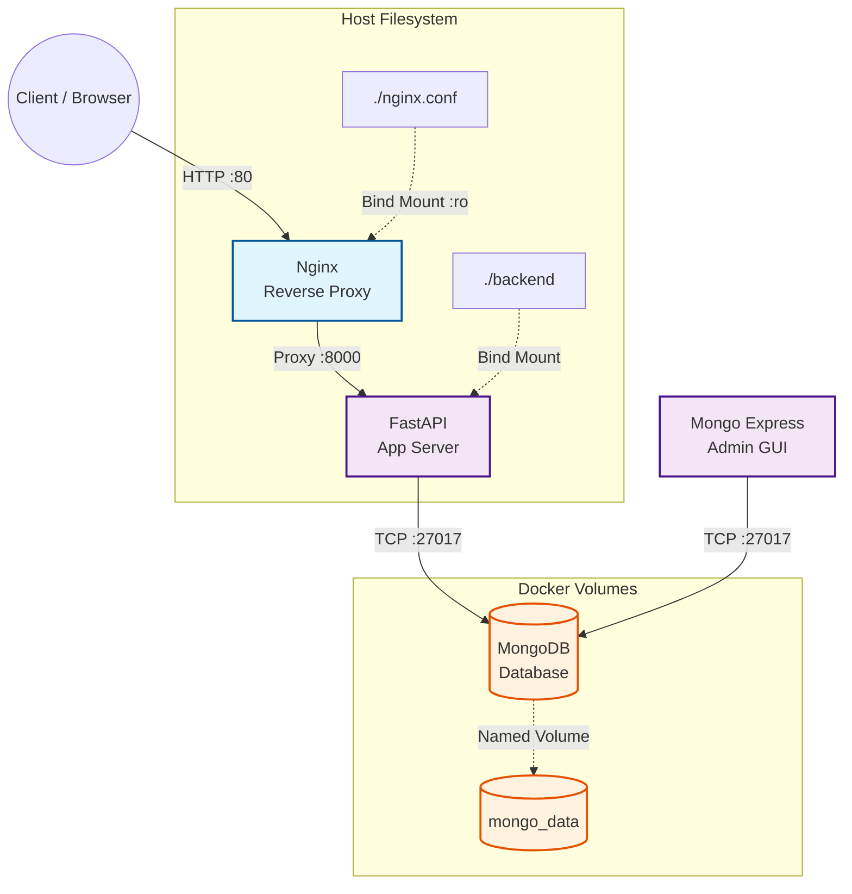
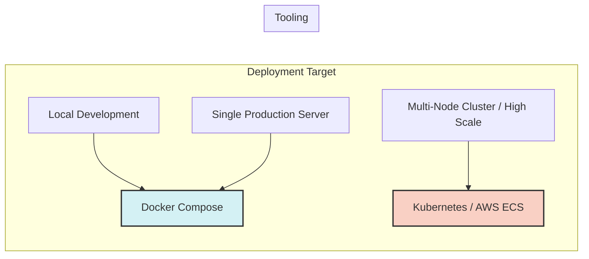

# Docker Tutorial: Advanced Configuration & Production Readiness
*Continuation of the Comprehensive Guide*

## 5. Complete Stack Configuration Blueprint

This section details the structural architecture for a production-like 4-tier microservice stack (Nginx, FastAPI, MongoDB, and Mongo Express) and provides the exact `docker-compose.yml` configuration.

### Architectural Flow & Mount Strategy



### The Production-Ready `docker-compose.yml`

```yaml
version: "3.8"

services:
  # 1. Web / Reverse Proxy
  nginx:
    image: nginx:1.25-alpine
    ports:
      - "80:80"
    volumes:
      - ./nginx.conf:/etc/nginx/nginx.conf:ro  # Read-only bind mount
    depends_on:
      - api
    restart: unless-stopped

  # 2. Application Backend
  api:
    build:
      context: ./backend
      dockerfile: Dockerfile
    ports:
      - "8000:8000"
    env_file:
      - .env
    volumes:
      - ./backend:/app  # Bind mount for live reload during development
    depends_on:
      - mongo
    restart: unless-stopped

  # 3. Database
  mongo:
    image: mongo:7.0
    ports:
      - "27017:27017"
    environment:
      MONGO_INITDB_ROOT_USERNAME: ${MONGO_USER}
      MONGO_INITDB_ROOT_PASSWORD: ${MONGO_PASS}
    volumes:
      - mongo_data:/data/db  # Named volume for persistent data
    restart: unless-stopped

  # 4. Database Admin GUI
  mongo-express:
    image: mongo-express:latest
    ports:
      - "8888:8081"
    environment:
      ME_CONFIG_MONGODB_ADMINUSERNAME: ${MONGO_USER}
      ME_CONFIG_MONGODB_ADMINPASSWORD: ${MONGO_PASS}
      ME_CONFIG_MONGODB_SERVER: mongo
    depends_on:
      - mongo
    restart: unless-stopped

volumes:
  mongo_data:  # Declaration of the named volume
```

---

## 6. Architectural Decision Matrix

When building and configuring containers, choosing the right tool or pattern depends heavily on your specific use case. 

### Configuration Choices

| Decision Point | Option A | Option B | Recommendation |
| :--- | :--- | :--- | :--- |
| **Storage Strategy** | **Bind Mounts** (`./app:/app`) | **Named Volumes** (`mongo_data:/data`) | Use **Bind Mounts** for source code during local dev (enables live updates). Use **Named Volumes** for database data and logs (better performance & OS isolation). |
| **Base Image** | **Debian/Ubuntu** (`python:3.11`) | **Alpine** (`python:3.11-alpine`) | Start with **Slim** (`python:3.11-slim`). Use **Alpine** for simple apps, but watch out for C-library compilation issues (e.g., `pydantic`, `numpy`). |
| **Secrets Delivery** | **Container Env Vars** (`ENV API_KEY=...`) | **Runtime File Mount / Vault** | Never embed secrets in the Dockerfile. Use `.env` files locally and cloud secrets managers (AWS Secrets, HashiCorp Vault) in production. |

### Orchestration Scaling Decision



---

## 7. Production-Readiness Checklist

Before shipping any containerized application to production, run through this final checklist. The items are grouped by operational category.

### Security & Build Hygiene
- [ ] **No `latest` Tags:** Every image tag in `Dockerfile` and `docker-compose.yml` specifies an explicit version (e.g., `python:3.11-slim` instead of `python:latest`).
- [ ] **Unprivileged User:** The `Dockerfile` includes a non-root user (`USER appuser`) so container processes do not run with root permissions.
- [ ] **Clean `.dockerignore`:** Unnecessary files (`.git`, `node_modules`, `__pycache__`, `.env`) are excluded from build contexts to reduce image size and prevent secret leaks.

### Reliability & Observability
- [ ] **Health Checks Configured:** Services contain `healthcheck:` definitions so orchestrators can automatically restart unhealthy containers.
- [ ] **Logs Rotated:** Log driver rotation limits are active so container logs do not fill up host disk space over time.

### Resource Management
- [ ] **Resource Limits Enforced:** Memory and CPU limits are set in Compose (`deploy.resources.limits`) or deployment manifests to prevent one container from crashing the host machine.

---

> **Key Rule of Thumb:** If a containerized app works on your machine, it will work in production—*provided* you do not break isolation by hardcoding host paths or relying on local system binaries.
